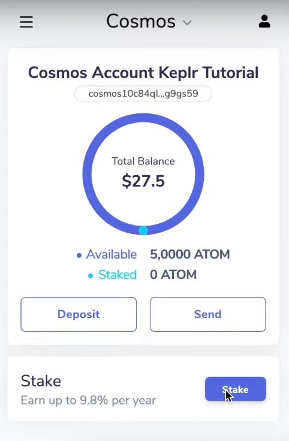
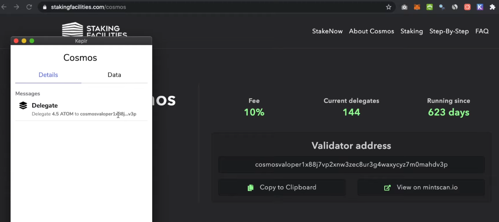
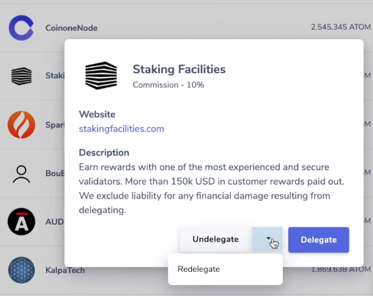
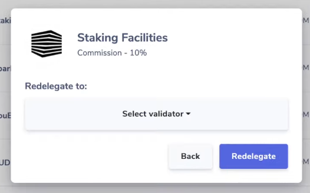

# Staking
The Archway network is a Proof-Of-Stake (PoS) blockchain, meaning that the weight of validators is determined by the amount of staking tokens (ARCHs) bonded as collateral. These ARCHs can be self-delegated directly by the validator or delegated to them by other ARCH holders.

Any user in the system can declare their intention to become a validator by sending a `create-validator` transaction. From there, they become validator candidates.

## Staking
The weight (i.e. voting power) of a validator determines whether or not they are an active validator

Delegators are ARCH holders who cannot, or do not want to run a validator themselves. ARCH holders can delegate ARCHs to a validator and obtain a part of their revenue in exchange.

Now let's see how we can delegate some tokens to a validator.

You can stake by:
- [Runing a validator](./validator/running-a-validator-node.md)
- [Delegating](./staking.md#Delegate)

## Delegate
You can stake by delegating your tokens to validators who process transactions and run the network.

This allows ARCH holders that don't have the skills or desire to run a validator to participate in securing the network and be rewarded.

### CLI

#### Requirements
- [Installation](./wallet.md#CLI)
- [Create an account](./wallet.md#CLI)

#### Connecting to the network
In order to delegate your stake you have to either [run your node](./node/join-a-network.md) or you can connect to a trustworthy operator.

Malicious operator could return incorrect query results or censor your transactions. However, they will never be able to steal your funds, as your private keys are stored locally on your computer or ledger device. Possible options of full-node operators include validators, wallet providers or exchanges.

in order to connect to the network we must 

##### Config CLI

First create the client config file:

```bash
touch ~/.archway/config/client.toml
```

If the home directory for your node is different, please use the following:

```bash
touch <YOUR_NODES_HOME_DIR>/config/client.toml
```

We must set the default value for the node we are connecting to

```sh
archwayd config node <host>:<port>
```

Finally let's set up the chain ID of the network we want to interact with

```sh
archwayd config chain-id constantinople
```

#### Send funds
In order to delegate we need to send a delegate transaction to a validator

```sh
archwayd tx staking delegate <validatorOperatorAddress> <amountToBond> --from <yourKeyName> --gas auto --gas-adjustment 1.5 --gas-prices <gasPrice>
```

#### Find Validator's Operator Address

We can query all the validators and pick the one we want to delegate tokens to it.

```bash
archwayd query staking validators
```
```yml
pagination: {}
validators:
- commission:
    commission_rates:
      max_change_rate: "0.100000000000000000"
      max_rate: "0.100000000000000000"
      rate: "0.010000000000000000"
    update_time: "2021-10-12T20:15:35.967858491Z"
  consensus_pubkey:
    '@type': /cosmos.crypto.ed25519.PubKey
    key: X1LGMAY8dToCgBuMIMpctn20Fwenim2YTGoY9Y2J+To=
  delegator_shares: "1000000000.000000000000000000"
  description:
    moniker: my-validator
  min_self_delegation: "1"
  operator_address: archwayvaloper14gxqxpxulxssv7pr4kltr9tl5dujtestxvjhkp
  status: BOND_STATUS_BONDED
  tokens: "1000000000"
  unbonding_time: "1970-01-01T00:00:00Z"
```

As we can see in our example we have one validator and its operator address is `archwayvaloper14gxqxpxulxssv7pr4kltr9tl5dujtestxvjhkp`.

### Keplr


#### Staking

First open your `keplr` browser extension and click on the `Stake` button.

**Prerequisite:** Make sure to deposit some tokens beforehand.



After you click the `Stake` button, the `keplr` extension opens the `keplr web wallet`. 
In the list of validators, select the one you want and then select `Manage`.

**Warning:** Conduct proper research about the validator before staking your tokens with them.


Pick a validator.


A window opens showing the website of the validator with some extra information.
Select the `Delegate` button.


Enter the amount of tokens that you want to stake.

**Note:** Since there is a transaction fee, make sure not to delegate all your tokens.


After you select the `Delegate` button, another window allows you to select the transaction fees. If you want your transaction to be processed faster, you can offer a higher fee.


Now, select the `Set Fee` button.

On the following page, make sure the validator address is correct.


The validator address shows on their website. Now that you see the address is correct, you can approve it.



It takes a few moments for the transaction to get through. Open the `keplr` extension to see the updates on your account.


#### Claiming the Staking Reward

After some time, you can see the staking reward to be claimed.


To claim a reward, select the `Claim` button. 
Select a fee for the transaction and select the `Set Fee` button.


After a few moments, you ycan see the updates on our account.


**Note:** Since there is a transaction fee, it is recommended to periodically claim the reward.

## Undelegate and Redelegate

To undelegate your staked tokens, select the validator from the list of validators in your `keplr web wallet` and then select the `Undelegate` button.

**Note:** The unbonding period in Cosmos-based networks is `21` days. 


To redelegate your tokens to another validator, select `Redelegate` from the menu.



Then you can select another validator from the list.




_Screenshots from: https://youtu.be/KYntLOLnLdg_
